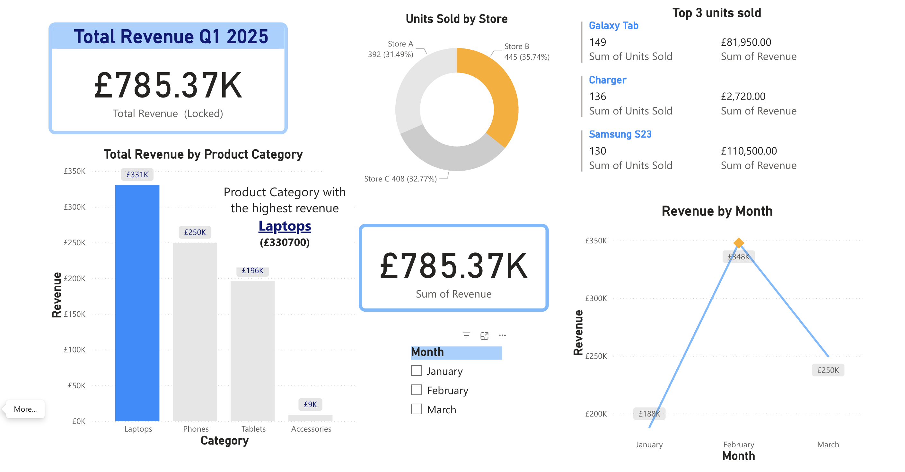

# Retail Store Sales Analysis with Power BI

## 📝 Project Description

This project aims to help a small chain of electronic retail stores understand their performance during the first quarter of 2025.

## 🎯 Business Questions / Analysis Objectives

This analysis will address questions such as: 

1. What is the total revenue for Q1 2025?
2. Which product category generated the most revenue?
3. Which store sold the highest number of units?
4. What were the top 3 best-selling products by units sold?
5. What was the trend of total revenue over the three months? 

## 📊 Power BI Dashboard

🔗 https://app.powerbi.com/groups/me/reports/2577ac2c-b13b-4379-98da-24e54f246836/a9451e053c0865c04dbd?experience=power-bi

## 📁 Project Structure

```
project-folder/
├── retail_sales_q1_2025_large.csv/                        # Raw dataset
├── retail_stores_sales_liovirgilda.pbix/                  # Power BI (.pbix) project
├── retail_store_sales_dashboard.png/                      # Screenshots 
└── README.md                                              # Project overview (this file)
```

## 📂 Datasets Used

- **Source:** [Generation UK]
- **Name:** retail_sales_q1_2025_large
- **Description:** Dataset containing name of product, price of unit, product category, store, date, etc.
- **Rows / Columns:** 150 rows/ 7 columns

## 🛠 Tools & Technologies

| Tool          | Purpose                          |
|---------------|----------------------------------|
| Power BI      | Data visualization & dashboarding|
| CSV           | Data source format               |
| DAX           | Calculations                     |
| Power Query   | Data cleaning & transformation   |

## 📈 Key Features of the Dashboard

- Interactive filters for January, February and March months
- Cards with Sum of Revenue and Multi-Row card to show top 3 units sold
- Bar, line, and donut pie visuals to show comparisons and trends

## 💡 Key Insights

Summarize:

- The total revenue in the first quarter of 2025 was £785,370.00.
- Store B sold the highest number of units (445), generating £280,320.00, which is equivalent to 35.69% of total revenue.
- The Laptops product category generated the highest revenue—£330,700.00, equivalent to 42.11% of total revenue.
- The top 3 units sold in Q1 2025 were Galaxy Tab, Chargers, and Samsung S23.
- The peak revenue was £347,780.00 in February, followed by a 28% drop in March to £249,560.00.

## 📸 Screenshots

Dashboard:



## 📌 How to Use This Repository

1. Clone this repo:  
   ```bash
   git clone https://github.com/liovirgilda/retail_store_sales_powerbi.git
   ```
2. Open the `.pbix` file in Power BI Desktop.
3. Update the data source path if needed.
4. Explore, customize, or publish the dashboard to Power BI Service.

## 🧠 Learning Outcomes

- Learned to clean and update data fields using Power Query
- Built measures using DAX
- Designed interactive dashboards optimized for decision-making

## 🙋‍♀️ Contact

**Liovirgilda M**  
_Data Analytics Student_  
🔗 [LinkedIn](https://www.linkedin.com/in/liovirgilda/) | [GitHub](https://github.com/liovirgilda)
